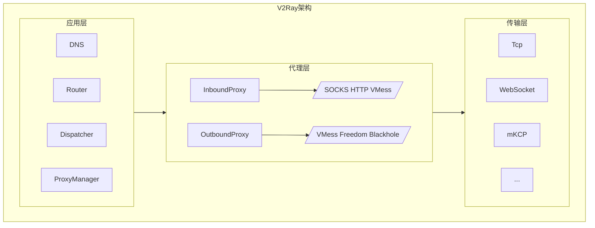

# proxy1

### 大体流程

V2Ray 内核分为三层：应用层、代理层和传输层。每一层内包含数个模块，模块间互相独立，同类型的模块可无缝替换。


```mermaid
flowchart TD
    subgraph V2Ray架构
        subgraph 应用层
        direction LR
        DNS
        Router
        Dispatcher
        ProxyManager
        end
        subgraph 代理层
        direction LR
        InboundProxy-->111[/SOCKS HTTP VMess/]
        OutboundProxy-->222[/VMess Freedom Blackhole/]
        end
        subgraph 传输层
        direction LR
        Tcp
        WebSocket
        mKCP
        ...
        end
    end
    应用层 --> 代理层 --> 传输层
```

### 启动proxy

1. 启动
```bash
docker-compose build
docker-compose up -d
docker-compose logs
```

## 修改配置


## 更换端口流程

